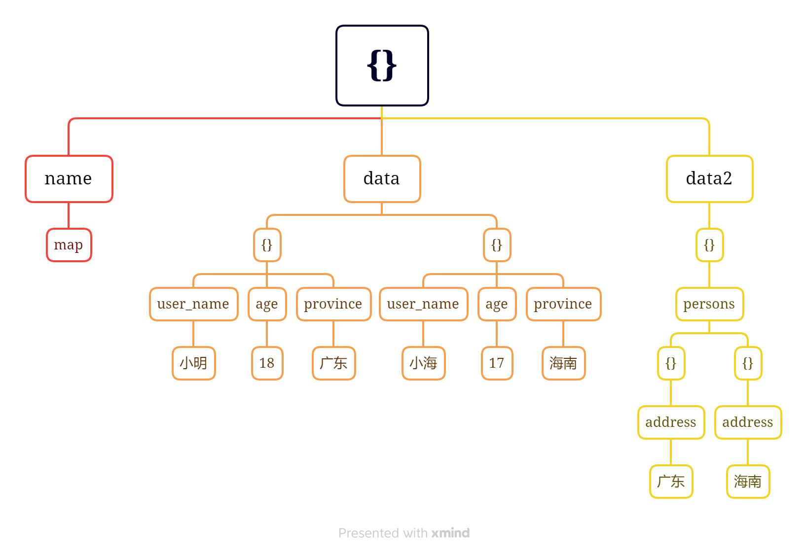
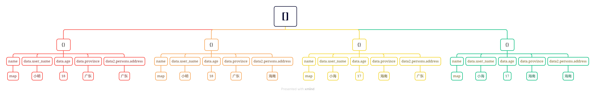

# 对象扁平化实现

> 适用于将 JSON, XML, HTML，yaml, toml 相关格式的对象扁平化
>
> 主要适用于将半结构化的数据转为结构化的数据

常见的场景: 比如 elastic, mongo，通用 🕷 API 返回的 JSON 数据转为有结构化的数据

## 场景

比如一个简单的 JSON 数据:

```JSON
{
    "age": 18,
    "name": "小明"
}
```

然后转化之后，结构变成下面这样:

```json
[
  {
    "age": 18,
    "name": "小明"
  }
]
```

上面的样例数据会解析成一条

下面的样例数据相对复杂：

```json
{
  "name": "map",
  "data": [
    {
      "user_name": "小明",
      "age": 18,
      "province": "广东"
    },
    {
      "user_name": "小海",
      "age": 17,
      "province": "海南"
    }
  ],
  "data2": [
    {
      "persons": [
        {
          "address": "广东"
        },
        {
          "address": "海南"
        }
      ]
    }
  ]
}
```

上面的数据会解析成下面这样(一共四条)

```json
[
  {
    "data.age": 18,
    "data.province": "广东",
    "data.user_name": "小明",
    "data2.persons.address": "广东",
    "name": "map"
  },
  {
    "data.age": 18,
    "data.province": "广东",
    "data.user_name": "小明",
    "data2.persons.address": "海南",
    "name": "map"
  },
  {
    "data.age": 17,
    "data.province": "海南",
    "data.user_name": "小海",
    "data2.persons.address": "广东",
    "name": "map"
  },
  {
    "data.age": 17,
    "data.province": "海南",
    "data.user_name": "小海",
    "data2.persons.address": "海南",
    "name": "map"
  }
]
```

## algo 实现原理

\_
先简单描述一下 JSON 对象的原始树状结构:

```json
{
  "name": "map",
  "data": [
    {
      "user_name": "小明",
      "age": 18,
      "province": "广东"
    },
    {
      "user_name": "小海",
      "age": 17,
      "province": "海南"
    }
  ],
  "data2": [
    {
      "persons": [
        {
          "address": "广东"
        },
        {
          "address": "海南"
        }
      ]
    }
  ]
}
```



然后转换之后的树状结构如下



显然地，一个 JSON 对象，扁平化之后，可能会生成多个对象, 并且生成的对象和原始对象的子元素类型有很强的依赖关系，主要表现为，一个对象扁平化之后可以生成多少个子对象，和字段类型以及子子字段(递归计算)为列表类型长度的乘积关系

### 如果字段值为基本类型(整形，布尔，浮点，字符串)，只需要扩展当前字段的数量

```go
reflect.Int, reflect.Int8, reflect.Int16, reflect.Int32, reflect.Int64,
reflect.Uint, reflect.Uint8, reflect.Uint16, reflect.Uint32, reflect.Uint64,
reflect.Bool, reflect.Uintptr, reflect.Float32, reflect.Float64, reflect.String:
tmp := cpm(currentMap)
tmp[prefix] = data
return append(result, tmp)
```

### 如果字段值为列表，需要将使用列表的内容扩展当的字段

```go
case reflect.Slice:
  var newList []map[string]interface{}
  var s = reflect.ValueOf(data)
  for i := 0; i < s.Len(); i++ {
    # 调用 normalize, 将列表里的值扩展到当前的对象
    var _res = c.normalize(s.Index(i).Interface(), prefix, cpm(currentMap), depth+1)
    newList = append(newList, _res...)
  }
  // 如果列表为空, 返回 currentMap 对象本身的数组
  // case { "data": []}
  if len(newList) == 0 {
    newList = append(newList, cpm(currentMap))
  }
  return newList
```

### 如果字段值是字典类型，那么则需要根据字段类型做判断

先遍历当前的字典，然后根据字段类型做不同的逻辑处理

#### 如果字段值为基本类型(整形，布尔，浮点，字符串)，需要将这个扩展字段复制到所有同级的元素

```go
case reflect.Map:
  var newList = []map[string]interface{}{cpm(currentMap)}
  for mr := reflect.ValueOf(data).MapRange(); mr.Next(); {
    _key := mr.Key().Interface()
    _v := mr.Value().Interface()
    switch reflect.TypeOf(_v).Kind() {
    case
      reflect.Int, reflect.Int8, reflect.Int16, reflect.Int32, reflect.Int64,
      reflect.Uint, reflect.Uint8, reflect.Uint16, reflect.Uint32, reflect.Uint64,
      reflect.Bool, reflect.Uintptr, reflect.Float32, reflect.Float64, reflect.String:
      // 如果当前的值 数值，整型，布尔时，填充到所有已经遍历的对象
      for i := range newList {
        newList[i][c.separator.AppendToPrefix(prefix, _key)] = _v
      }
    }
  }
  return newList
```

### 如果字段值为字典或者列表时，需要重新迭代新的字段，currentMap 元素为已经遍历的元素

```go
  var newList = []map[string]interface{}{cpm(currentMap)}
  for mr := reflect.ValueOf(data).MapRange(); mr.Next(); {
    _key := mr.Key().Interface()
    _v := mr.Value().Interface()

    switch reflect.TypeOf(_v).Kind() {

    case reflect.Map, reflect.Slice:
      var copyList = make([]map[string]interface{}, 0)
      // 将子元素的内容扩展到所有已经遍历的对象列表中
      for _, _v2 := range newList {
        var _res = c.normalize(_v, c.separator.AppendToPrefix(prefix, _key), _v2, depth+1)
        copyList = append(copyList, _res...)
      }
      newList = copyList
    }
  }
  return newList

```

完整实现如下:

``` go
package alt

import (
 "fmt"
 "os"
 "reflect"
)

const (
 Infinity = -1
)

type Parser interface {
 Parse(data interface{}) (result []map[string]interface{}, err []error)
}

type Separator interface {
 AppendToPrefix(prefix string, key interface{}) string
}

type Logger interface {
 Debug(args ...interface{})
 Info(args ...interface{})
 Warn(args ...interface{})
 Error(args ...interface{})
}

type StrSeparator string

func (c StrSeparator) AppendToPrefix(prefix string, key interface{}) string {
 if prefix == "" {
  return fmt.Sprintf("%v", key)
 }
 return fmt.Sprintf("%s%v%v", prefix, c, key)
}

func NewDataEtlParser(opt ...OptionFunc) Parser {
 v := &dataEtl{
  maxDepth:  Infinity,
  ignore:    make(map[string]struct{}),
  logger:    NewStdLogger(LevelDebug, os.Stdout),
  separator: StrSeparator("."),
 }
 for _, f := range opt {
  f(v)
 }
 return v
}

type OptionFunc func(c *dataEtl)


type dataEtl struct {
 separator Separator
 logger    Logger
 err       []error
 maxDepth  int
 ignore    map[string]struct{}
}

func (c *dataEtl) Parse(data interface{}) (result []map[string]interface{}, err []error) {
 c.err = c.err[0:0]
 if data == nil {
  return nil, c.err
 }
 return c.normalize(data, "", make(map[string]interface{}), 0), c.err
}

func (c *dataEtl) normalize(
 data interface{},
 prefix string,
 currentMap map[string]interface{},
 depth int,
) (result []map[string]interface{}) {
 if _, find := c.ignore[prefix]; data == nil || (depth > c.maxDepth && c.maxDepth != Infinity) || find {
  msg := fmt.Sprintf(
   "invalid data %v or depth <%d> is bigger than max_depth <%d>, more: if max_depth is <%d> is infinity"+
    "or mose key is ignore",
   data == nil, depth, c.maxDepth, Infinity)
  c.err = append(c.err, fmt.Errorf(msg))
  c.logger.Warn(msg)
  return []map[string]interface{}{cpm(currentMap)}
 }
 switch reflect.TypeOf(data).Kind() {
 case
  reflect.Int, reflect.Int8, reflect.Int16, reflect.Int32, reflect.Int64,
  reflect.Uint, reflect.Uint8, reflect.Uint16, reflect.Uint32, reflect.Uint64,
  reflect.Bool, reflect.Uintptr, reflect.Float32, reflect.Float64, reflect.String:
  tmp := cpm(currentMap)
  tmp[prefix] = data
  c.logger.Debug(fmt.Sprintf("current type is %v, value is %v", reflect.TypeOf(data).Kind(), data))
  return append(result, tmp)
 case reflect.Slice:
  var newList []map[string]interface{}
  var s = reflect.ValueOf(data)
  c.logger.Debug(fmt.Sprintf("type is slice len is %d", s.Len()))
  for i := 0; i < s.Len(); i++ {
   var _res = c.normalize(s.Index(i).Interface(), prefix, cpm(currentMap), depth+1)
   newList = append(newList, _res...)
  }
  // 如果列表为空, 返回 currentMap 对象本身的数组
  if len(newList) == 0 {
   newList = append(newList, cpm(currentMap))
  }
  return newList
 case reflect.Map:
  c.logger.Debug("type is map ", data)
  var newList = []map[string]interface{}{cpm(currentMap)}
  for mr := reflect.ValueOf(data).MapRange(); mr.Next(); {
   _key := mr.Key().Interface()
   _v := mr.Value().Interface()
   c.logger.Debug(fmt.Sprintf("rec map key:%v, value:%v", _key, _v))
   // NOTE 必须保证判断是有效的
   // this case { "data": null }
   if _v == nil {
    c.logger.Warn(_key, " nil type ")
    continue
   }

   switch reflect.TypeOf(_v).Kind() {
   case
    reflect.Int, reflect.Int8, reflect.Int16, reflect.Int32, reflect.Int64,
    reflect.Uint, reflect.Uint8, reflect.Uint16, reflect.Uint32, reflect.Uint64,
    reflect.Bool, reflect.Uintptr, reflect.Float32, reflect.Float64, reflect.String:
    // 如果当前的值 数值，整型，布尔时，填充到所有已经遍历的对象
    for i := range newList {
     newList[i][c.separator.AppendToPrefix(prefix, _key)] = _v
    }
   case reflect.Map, reflect.Slice:
    var copyList = make([]map[string]interface{}, 0)
    c.logger.Debug(fmt.Sprintf("type is %v", reflect.TypeOf(_v)))
    for _, _v2 := range newList {
     var _res = c.normalize(_v, c.separator.AppendToPrefix(prefix, _key), _v2, depth+1)
     copyList = append(copyList, _res...)
    }
    newList = copyList
   default:
    c.logger.Warn("know type ", reflect.TypeOf(_v).Kind())
   }
  }
  return newList
 default:
  c.logger.Warn("know type ", reflect.TypeOf(data).Kind())
 }
 return []map[string]interface{}{cpm(currentMap)}
}

func cpm(src map[string]interface{}) (dst map[string]interface{}) {
 dst = make(map[string]interface{}, len(src))
 for _k, _v := range src {
  dst[_k] = _v
 }
 return dst
}

```
